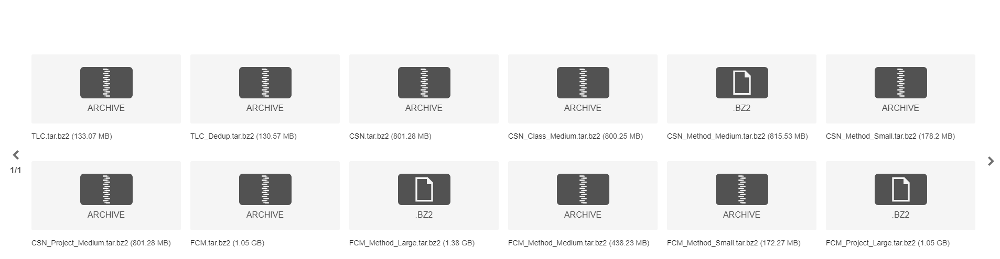

## The Overview of 12 Datasets

|   Name | Training  | validation |  Test   | #Class  |#project| Description                |
|:-------|:----------|:-----------|:--------|:--------|:-------|:------------------------|
| TLC                  | 69,708    | 8,714      | 8,714   | –       | 9,732  | Original [TL-CodeSum](https://github.com/xing-hu/TL-CodeSum)    |
|TLC_Dedup             | 69,708    | 8,714      | 6,449   | –       | –      | Deduplicated TL-CodeSum |
| CSN                  | 454,044   | 15,299     | 26,897  | 136,495 | 25,596 | Filtered [CodeSearchNet](https://github.com/github/CodeSearchNet) |
| CSN_Project_Medium   | 454,044   | 15,299     | 26,897  | 136,495 | 25,596 | split by project        |
| CSN_Class_Medium     | 448,780   | 19,716     | 28,192  | 136,495 | 25,596 | split by class          |
| CSN_Method_Medium    | 447,019   | 19,867     | 29,802  | 136,495 | 25,596 | split by method         |
| CSN_Method_Small     | 69,708    | 19,867     | 29,802  | –       | –      | Subset of               |
| FCM                  | 1,908,694 | 104,948    | 104,777 | –       | 28,790 | Filtered [Funcom](https://github.com/mcmillco/funcom)       |
| FCM_Project_Large    | 1,908,694 | 104,948    | 104,777 | –       | 28,790 | Split by project        |
| FCM_Method_Large     | 1,908,694 | 104,948    | 104,777 | –       | 28,790 | Split by method         |
| FCM_Method_Medium    | 454,044   | 104,948    | 104,777 | –       | –      | Subset of               |
| FCM_Method_Small     | 69,708    | 104,948    | 104,777 | –       | –      | Subset of               |

These raw and processed dataset can be downloaded from [here](https://figshare.com/s/fe32740133b33d719ab5)
