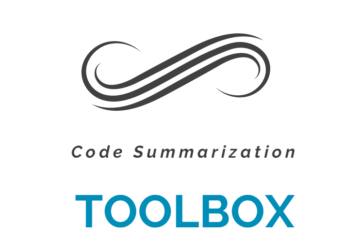

# On the Evaluation of Neural Code Summarization
This is the replication package for ["On the Evaluation of Neural Code Summarization"](https://arxiv.org/abs/2107.07112) accepted to ICSE2022.

 
 Note: If the above image can not be rendered correctly, please clear the cache of web browser and refresh the page.
 
 We build a shared code summarization toolbox containing:

 * 12 raw and processed datasets, 
 * 4 code pre-processing operations and 16 combination implementations, 
 * 6 BLEU variants implementation,  
 * re-implement code for the paper without code, 
 * all predicted logs in our paper.

## Content
- [Datasets](#datasets)
- [Data Pre-processing](#data-pre-processing)
- [Baselines](#baselines)
- [Evaluated Metric](#evaluated-metric)
- [Predicted Logs](#predicted-logs)

## Datasets

The overview of dataset:

|   Name | Training  | validation |  Test   | #Class  |#project| Description                |
|:-------|:----------|:-----------|:--------|:--------|:-------|:------------------------|
| TLC                | 69,708     | 8,714   | 8,714   | –      | 9,732  | Original [TL-CodeSum](https://github.com/xing-hu/TL-CodeSum)    |
|TLC_Dedup             | 69,708    | 8,714      | 6,449   | –       | –      | Deduplicated TL-CodeSum |
| CSN                  | 454,044   | 15,299     | 26,897  | 136,495 | 25,596 | Filtered [CodeSearchNet](https://github.com/github/CodeSearchNet) |
| CSN_Project_Medium   | 454,044   | 15,299     | 26,897  | 136,495 | 25,596 | split by project        |
| CSN_Class_Medium     | 448,780   | 19,716     | 28,192  | 136,495 | 25,596 | split by class          |
| CSN_Method_Medium    | 447,019   | 19,867     | 29,802  | 136,495 | 25,596 | split by method         |
| CSN_Method_Small     | 69,708    | 19,867     | 29,802  | –       | –      | Subset of CSN_Method_Medium               |
| FCM                  | 1,908,694 | 104,948    | 104,777 | –       | 28,790 | Filtered [Funcom](https://github.com/mcmillco/funcom)       |
| FCM_Project_Large    | 1,908,694 | 104,948    | 104,777 | –       | 28,790 | Split by project        |
| FCM_Method_Large     | 1,908,694 | 104,948    | 104,777 | –       | 28,790 | Split by method         |
| FCM_Method_Medium    | 454,044   | 104,948    | 104,777 | –       | –      | Subset of  FCM_Method_Large              |
| FCM_Method_Small     | 69,708    | 104,948    | 104,777 | –       | –      | Subset of  FCM_Method_Large              |

These raw or processed datasets can be downloaded from [here](https://figshare.com/s/fe32740133b33d719ab5)

## Data Pre-processing 

    USAGE:
    
        cd codepreprocessing/
        python preprocess.py -h [-OPTIONS...]
    
    OPTIONS:
    
          -h, --help            show this help message and exit
          -data_filename DATA_FILENAME
                                The path of raw dataset
          -java_files_dir JAVA_FILES_DIR
                                The directory to save extracted Java file
          -output_dir OUTPUT_DIR
                                The directory to save processed files
          -djl                  Parse source code using javalang
          -dfp                  Filter punctuation in code tokens
          -dsi                  Split identifiers according to camelCase and
                                snake_case
          -dlc                  Lowercase code tokens
          -dr                   Replace string and number witt generic symbols
                                <STRING> and <NUM> in code tokens
          -cfp                  Filter punctuation in summaries
          -csi                  Split summary token according to camelCase and
                                snake_case
          -clc                  Lowercase summary tokens
          -sbt_type {1,2}       1：SBT_AO; 2:SBT

    
    DEFAULTS:
    
       - If not specified, the default [`data_filename'] is [`original/data.pkl`]
       - If not specified, the default [`java_files_dir'] is [`./java_files`]
       - If not specified, the default [`output_dir'] is [`./processed`]
       - If not specified, the default [-djl], [-dfp], [-dsi], [-dlc], [-dr], [-cfp], [-csi] and [-clc] are False
       - If not specified, the default [`sbt_type'] is [`2`]
       
       
    EXAMPLES:
    
        python preprocess.py -djl
        
            This example will use javalang to tokenize the all Java methods.
    
        python preprocess.py -djl -dsi -dlc 
        
            This example will use javalang to tokenize all Java methods.
            Then split identifiers according to camelCase and snake_case and lowercase them.
            
    NOTES:
        
       - data.pkl saves a dict. 
       The keys  are ['train', 'test', 'val']
       The values are {fid:item}. item is {"code":"xxx", "summary":"xxx"}
       - The tools are based on python3
       - The packages "spiral" and "javalang" are needed. You can install them by:
            pip install git+https://github.com/casics/spiral.git
            pip install  javalang==0.12.0
      

## Baselines

|   Models     | Source  |          
|:-------      |:----------|
|   Codenn     |   https://github.com/sriniiyer/codenn        |  
|   Deepcom    |   ./Deepcom_Reimplement        |  
|   Astattgru  |   https://github.com/mcmillco/funcom         |  
|   Rencos     |   https://github.com/zhangj111/rencos        |  
|   NCS        |   https://github.com/wasiahmad/NeuralCodeSum |  

## Evaluated Metric

    USAGE:
    
        cd metric
        python evaluate.py 
    
    OPTIONS:
    
        --refs_filename  The path of the reference file
        --preds_filename The path of the predicted file
        
    DEFAULTS:
        - If not specified, the default [`refs_filename'] is [`test/test.gold`]

        - If not specified, the default [`preds_filename'] is [`test/test.pred`]

    EXAMPLES:
        python evaluate.py 
        
        This example will calculate the six bleu variants scores between [`test/test.gold`] and [`test/test.pred`]
        output:
        
        +-----------+---------+---------+---------+----------+---------+
        | BLEU-DCOM | BLEU-FC | BLEU-DC | BLEU-CN | BLEU-NCS | BLEU-RC |
        +-----------+---------+---------+---------+----------+---------+
        |   18.94   | 18.3675 | 21.8686 | 27.9888 | 28.4195  | 18.9404 |
        +-----------+---------+---------+---------+----------+---------+
        
        
    NOTES:
        - The tools are based on python3
        - The packages "nltk"(3.6.1 or newer, "numpy" and "prettytable" are needed. You can install them by:
            pip install nltk==3.6.1 numpy  prettytable==2.1.0

      
## Predicted Logs
All Predicted Logs is saved in folder RQ. 

Folder Structure (Complete structure can be found [here](RQ/log))

        .
        ├── RQ1
        │         ├── calculate_correlation.py
        │         ├── cal_human_agreement.py
        │         ├── correlatio_coefficient_log
        │         ├── human_aggrement_log
        │         ├── human_evaluation.xlsx
        │         ├── README.md
        │         ├── RQ1.ipynb
        │         ├── score.xlsx
        │         ├── TLC
        │         │         ├── astattgru
        │         │         │         └── test.pred
        │         │         ├── codenn
        │         │         │         └── test.pred
        │         │         ├── deepcom
        │         │         │         └── test.pred
        │         │         ├── ncs
        │         │         │         └── test.pred
        │         │         ├── rencos
        │         │         │         └── test.pred
        │         │         └── test.gold
        │         └── TLC_dedup
        │             ├── astattgru
        │             │         └── test.pred
        │             ├── codenn
        │             │         └── test.pred
        │             ├── deepcom
        │             │         └── test.pred
        │             ├── ncs
        │             │         └── test.pred
        │             ├── rencos
        │             │         └── test.pred
        │             └── test.gold
        .....

### RQ1 BLEU Variants:

How do different evaluation metrics affect the performance of code summarization
and which is correlate with the human perception the most?

All the experiment results including the human evaluation, the significant testing can be found [here](RQ/RQ1/README.md).

### RQ2 Processing Method

How do different pre-processing operations affect the performance of code summarization?

All the experiment results including the significant testing can be found [here](RQ/RQ2/RQ2.ipynb).

### RQ3 Evaluated Dataset

How do different datasets affect the performance?

All the experiment results including the significant testing can be found [here](RQ/RQ3/RQ3.ipynb).

## Citation
If you use above data or source code , please consider citing our paper:

  @inproceedings{shi2022evaluation,
    title={On the evaluation of neural code summarization},
    author={Shi, Ensheng and Wang, Yanlin and Du, Lun and Chen, Junjie and Han, Shi and Zhang, Hongyu and Zhang, Dongmei and Sun, Hongbin},
    booktitle={Proceedings of the 44th International Conference on Software Engineering},
    pages={1597--1608},
    year={2022}
  }

Thanks!
